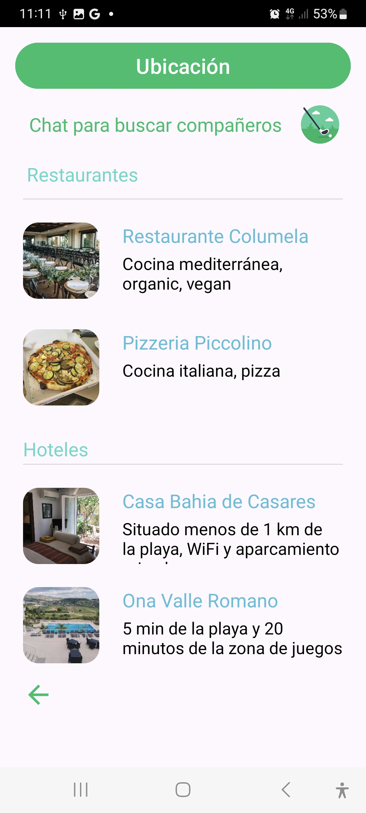
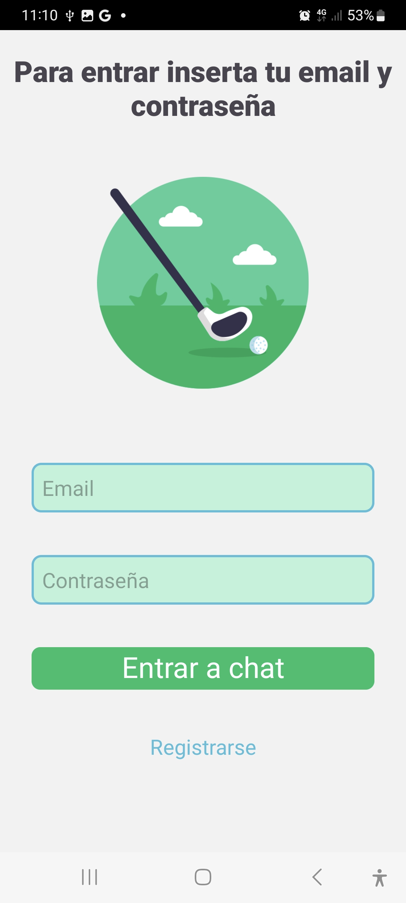
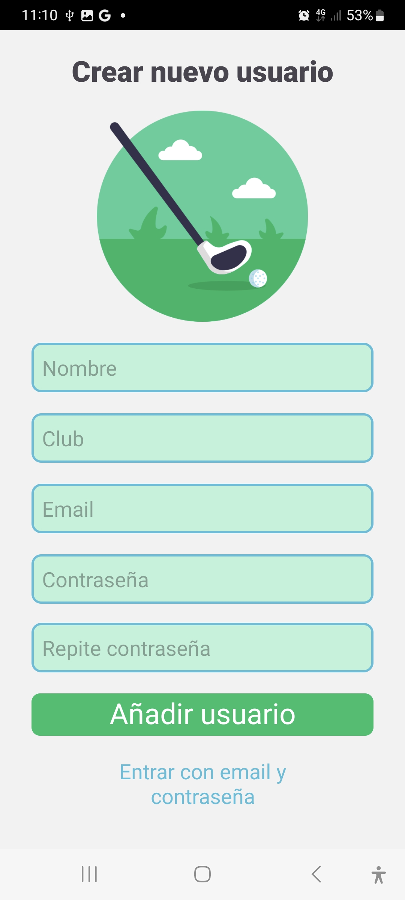
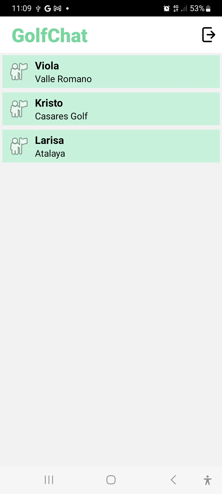
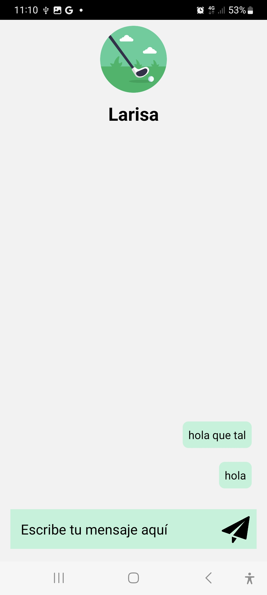

    

<h2>¿Qué es GolfApp? </h2>

Una aplicación basada en Android/Java que ayuda al usuario a encontrar el mejor club de golf. Para ello, el usuario evalúa las características de cada club, teniendo en cuenta la complejidad del recorrido, los servicios adicionales y las condiciones meteorológicas actuales. La aplicación también permite chatear con otros jugadores y encontrar compañeros de golf. 

<h3>Funcionamiento</h3>

<h4>Página principal</h4>

Página principal y búsqueda de clubes de golf en relación de la longitud del recorrido. La longitud y la dificultad del recorrido están determinadas por el número de hoyos. Al hacer clic en el club seleccionado, el usuario será redirigido a la página del club. Para entrar a la página principal y buscar un club, el usuario no necesita autenticación. 
 
 

    &nbsp;&nbsp;&nbsp;&nbsp;

<h4>Búsqueda de clubes</h4>

El usuario también puede ir a una página con  lista de todos los clubes de golf y buscar por una ciudad específica. Luego hará clic en la flecha a la derecha del club seleccionado y será llevado a la página del club. 
 

&nbsp;&nbsp;&nbsp;&nbsp;
    
 

<h4>Club de golf</h4>

Cada club se muestra en la página como una tarjeta con las características principales y más importantes. Aquí encontrará una descripción del recorrido la ruta, servicios adicionales, condiciones meteorológicas en tiempo real e información de contacto. Desde aquí el usuario podrá acceder al chat y buscar compañeros para jugar al golf.
 

    

 
En esta misma página, el usuario encontrará restaurantes y hoteles cercanos. 
 
 

    

<h4>Chat</h4>
Para utilizar el chat, el usuario deberá pasar una autenticación  mediante correo electrónico y contraseña.
 
 

    

 
Si el usuario aún no tiene cuenta deberá registrarse, y ingresar su nombre, nombre del club, dirección de correo electrónico y generar una contraseña.
 
 

    

 
Después de una autenticación automática exitosa, el usuario será redirigido a una página con lista de todos los usuarios registrados.
 
 

    

 
 Al hacer clic en el icono del usuario, se abrirá una página de chat donde el usuario podrá escribir y enviar un mensaje.
  
  

    

 
<h3>Descargar APK</h3>
 

 

<h3>Bibliografía</h3>

&nbsp;[Android](https://developer.android.com/)
 
&nbsp;[Firebase](https://firebase.google.com/docs)
 
&nbsp;[Youtube](https://www.youtube.com/results?search_query=firebase+recyclerview+android+studio)
 
&nbsp;[StackOverlow](https://stackoverflow.com/)
 

