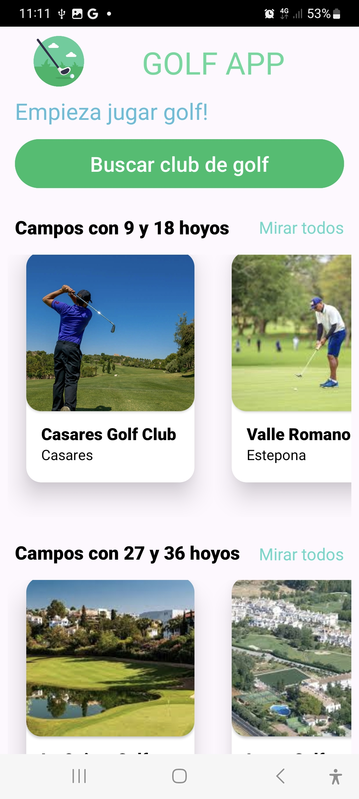
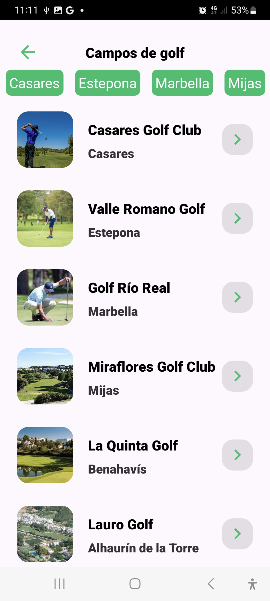
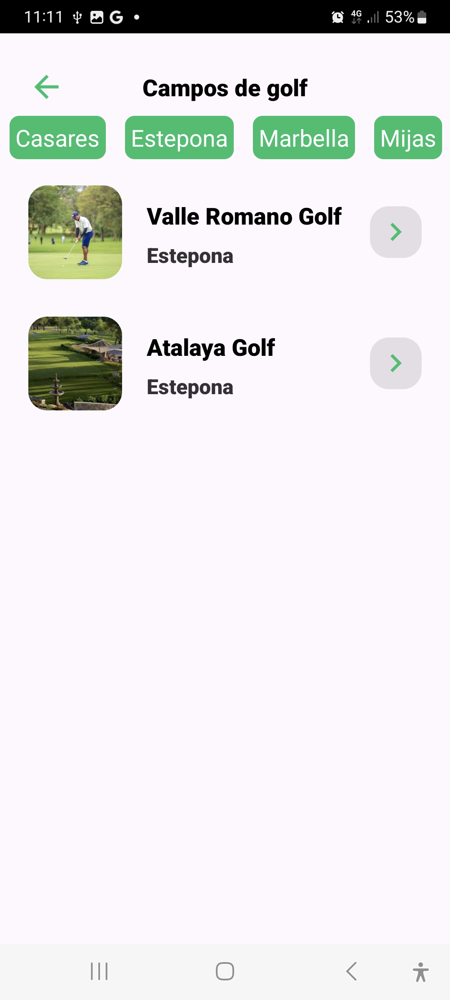

    

## &nbsp;¿Qué es GolfApp? 

Una aplicación basada en Android/Java que ayuda al usuario a encontrar el mejor club de golf. Para ello, el usuario evalúa las características de cada club, teniendo en cuenta la complejidad del recorrido, los servicios adicionales y las condiciones meteorológicas actuales. La aplicación también permite chatear con otros jugadores y encontrar compañeros de golf. 

##  &nbsp;Funcionamiento

<h3>Página principal</h3>

Página principal y búsqueda de clubes de golf en relación de la longitud del recorrido. La longitud y la dificultad del recorrido están determinadas por el número de hoyos. Al hacer clic en el club seleccionado, el usuario será redirigido a la página del club. Para entrar a la página principal y buscar un club, el usuario no necesita autenticación. 
 

    &nbsp;&nbsp;&nbsp;&nbsp;
    >

 

   
    

 

<h3>Búsqueda de clubes</h3>

El usuario también puede ir a una página con  lista de todos los clubes de golf y buscar por una ciudad específica. Luego hará clic en la flecha a la derecha del club seleccionado y será llevado a la página del club. 
 
 
&nbsp;&nbsp;&nbsp;&nbsp;
    

 
<h3></h3>

Cada club se muestra en la página como una tarjeta con las características principales y más importantes. Aquí encontrará una descripción del recorrido la ruta, servicios adicionales, condiciones meteorológicas en tiempo real e información de contacto. Desde aquí el usuario podrá acceder al chat y buscar compañeros para jugar al golf.

 

    

 

<h3>Editar tarea</h3>

    &nbsp;&nbsp;&nbsp;&nbsp;
    

## &nbsp;Descargar APK

 

##  &nbsp;Bibliografía
&nbsp;[Android](https://developer.android.com/)
 
&nbsp;[Firebase](https://firebase.google.com/docs)
 
&nbsp;[YoutubeMoureDev](https://www.youtube.com/c/MouredevApps)
&nbsp;[Youtube](https://www.youtube.com/results?search_query=firebase+recyclerview+android+studio)
 
&nbsp;[StackOverlow](https://stackoverflow.com/)
 

##  &nbsp;Otros repositorios
HLC/DI - [Landing Page en Angular](https://github.com/jairobuendia/Task4HomeLanding)
 
SGE - [Programa Python](https://github.com/jairobuendia/Task4HomePython)
